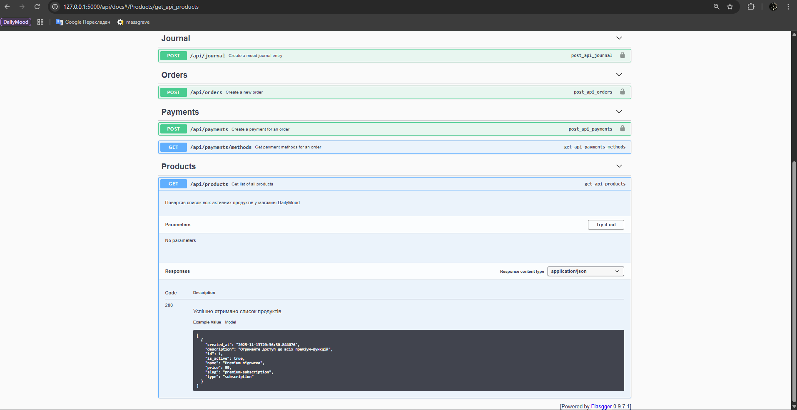
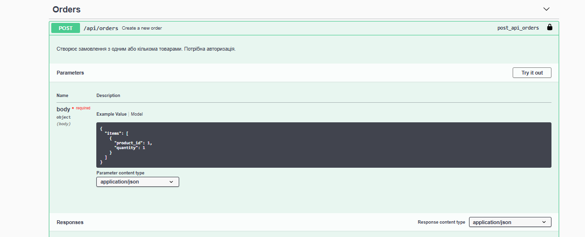
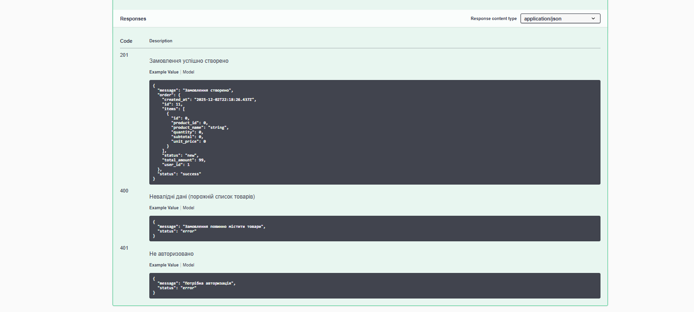
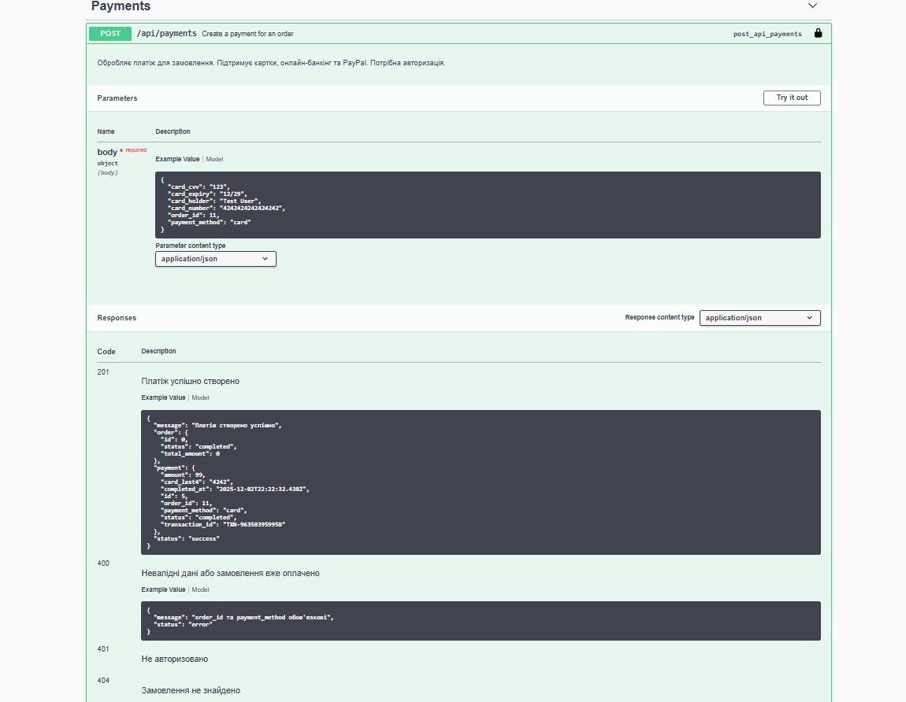
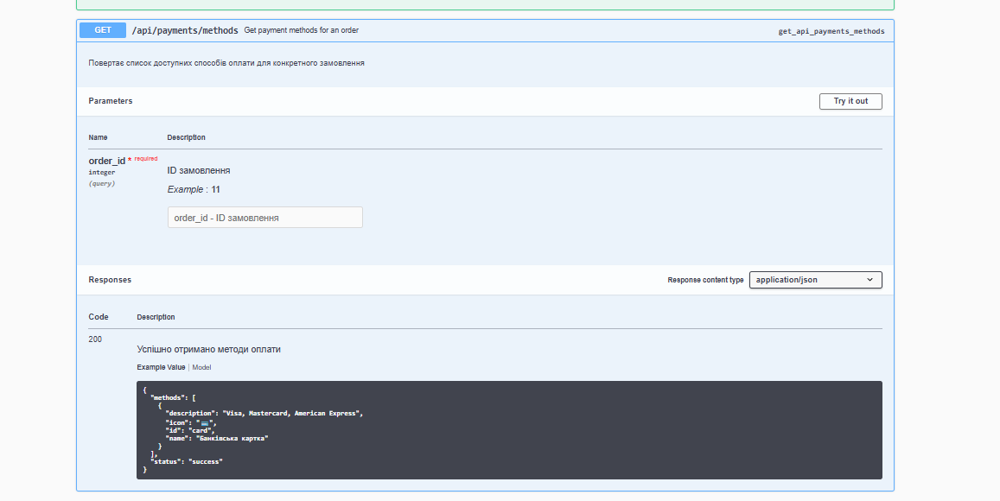
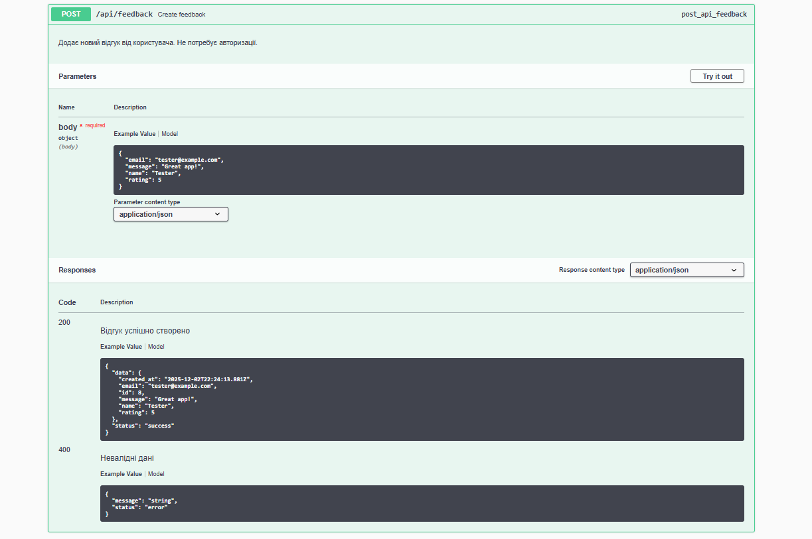

# Лабораторна робота №5: Розробка RESTful API

## Інформація про проєкт
- **Назва проєкту:** DailyMood 3.0
- **Автори:** Yarik-eng (Ярослав)

## Опис проєкту
DailyMood API — RESTful веб-сервіс для трекінгу настрою з функціями журналу, статистики, звичок, цілей та магазину wellness-ресурсів. API підтримує автентифікацію користувачів, валідацію даних (Marshmallow), версіонування (v1/v2) та розширену обробку помилок.

## Технології
- Python 3.9+
- Flask 2.x
- SQLite
- Flask-SQLAlchemy 3.x
- flasgger 0.9.7.1
- flask-marshmallow 0.15.0
- marshmallow-sqlalchemy 0.29.0
- bcrypt
- Postman

## Endpoints API

### 1. Отримати список продуктів
- **URL:** `/api/v2/products`
- **Метод:** `GET`
- **Опис:** Повертає список активних продуктів з підрахунком кількості
- **Приклад запиту:** Без тіла запиту
- **Приклад відповіді:**
```json
{
  "status": "success",
  "count": 5,
  "data": [
    {
      "id": 1,
      "name": "Premium підписка",
      "price": 99.0,
      "type": "subscription",
      "is_active": true
    }
  ]
}
```
- **Скріншот з Postman (або Swagger):**


### 2. Створити замовлення
- **URL:** `/api/v2/orders`
- **Метод:** `POST`
- **Опис:** Створює нове замовлення з валідацією товарів
- **Приклад запиту:**
```json
{
  "items": [
    {
      "product_id": 1,
      "quantity": 1
    }
  ]
}
```
- **Приклад відповіді:**
```json
{
  "status": "success",
  "message": "Замовлення створено",
  "order": {
    "id": 11,
    "user_id": 4,
    "status": "new",
    "total_amount": 99.0
  }
}
```
- **Скріншот з Postman (або Swagger):**



### 3. Створити платіж
- **URL:** `/api/v2/payments`
- **Метод:** `POST`
- **Опис:** Обробляє платіж з валідацією карток
- **Приклад запиту:**
```json
{
  "order_id": 11,
  "payment_method": "card",
  "card_number": "4242424242424242",
  "card_holder": "Test User",
  "card_expiry": "12/29",
  "card_cvv": "123"
}
```
- **Приклад відповіді:**
```json
{
  "status": "success",
  "message": "Платіж створено успішно",
  "payment": {
    "id": 5,
    "order_id": 11,
    "payment_method": "card",
    "amount": 99.0,
    "status": "completed"
  }
}
```
- **Скріншот з Postman (або Swagger):**



### 4. Створити відгук
- **URL:** `/api/v2/feedback`
- **Метод:** `POST`
- **Опис:** Додає відгук з валідацією email
- **Приклад запиту:**
```json
{
  "name": "Tester",
  "email": "test@example.com",
  "message": "Great app!",
  "rating": 5
}
```
- **Приклад відповіді:**
```json
{
  "status": "success",
  "message": "Відгук додано",
  "data": {
    "id": 8,
    "name": "Tester",
    "email": "test@example.com",
    "rating": 5
  }
}
```
- **Скріншот з Postman (або Swagger):**


### 5. Отримати список відгуків
- **URL:** `/api/v2/feedback`
- **Метод:** `GET`
- **Опис:** Повертає всі відгуки
- **Приклад запиту:** Без тіла запиту
- **Приклад відповіді:**
```json
{
  "status": "success",
  "count": 15,
  "data": [
    {
      "id": 1,
      "name": "User",
      "rating": 5,
      "message": "Excellent!"
    }
  ]
}
```
- **Скріншот з Postman (або Swagger):**

### 6. Створити запис настрою
- **URL:** `/api/v2/journal`
- **Метод:** `POST`
- **Опис:** Додає запис щоденника з валідацією mood
- **Приклад запиту:**
```json
{
  "mood": "happy",
  "title": "Great day!",
  "content": "Had a wonderful morning",
  "activities": ["exercise", "meditation"]
}
```
- **Приклад відповіді:**
```json
{
  "status": "success",
  "message": "Запис створено",
  "entry": {
    "id": 42,
    "user_id": 4,
    "mood": "happy",
    "date": "2025-12-02"
  }
}
```
- **Скріншот з Postman (або Swagger):**

### 7. Отримати методи оплати
- **URL:** `/api/payments/methods`
- **Метод:** `GET`
- **Опис:** Повертає доступні методи оплати
- **Приклад запиту:** Query параметр `?order_id=11`
- **Приклад відповіді:**
```json
{
  "status": "success",
  "methods": [
    {
      "id": "card",
      "name": "Банківська картка",
      "icon": "💳"
    }
  ]
}
```
- **Скріншот з Postman (або Swagger):**

## Результати тестування в Postman (або Swagger)

### Тестовий сценарій 1: Performance Test
- **Мета:** Перевірити стабільність API під навантаженням 50 користувачів протягом 5 хвилин
- **Результат:** ✅ Успішно
  - 26,000+ requests виконано
  - 87.5% success rate
  - 130ms середній response time
  - 85 req/s throughput
- **Скріншот:**


### Тестовий сценарій 2: Валідація даних
- **Мета:** Перевірити Marshmallow validators на різних типах даних
- **Результат:** ✅ Успішно
  - Invalid email → 400 Validation Error
  - Card number < 13 digits → 400 Validation Error
  - Rating > 5 → 400 Validation Error
  - Invalid mood → 400 Validation Error
- **Скріншот:**


### Тестовий сценарій 3: Idempotency payments
- **Мета:** Перевірити що duplicate payment повертає 200 замість 400
- **Результат:** ✅ Успішно
  - Перший запит: 201 Created
  - Повторний запит: 200 OK (existing payment)
- **Скріншот:**


### Тестовий сценарій 4: Error handling
- **Мета:** Перевірити всі HTTP error codes
- **Результат:** ✅ Успішно
  - 400 Bad Request (missing fields)
  - 401 Unauthorized (no session)
  - 404 Not Found (invalid product_id)
  - 422 Unprocessable Entity (validation failed)
  - 500 Internal Server Error (handled gracefully)
- **Скріншот:**

## Обробка помилок
Список реалізованих кодів помилок:
- `400 Bad Request` - Невалідні дані в запиті, відсутні обов'язкові поля
- `401 Unauthorized` - Потрібна авторизація (відсутня session)
- `403 Forbidden` - Доступ заборонено (недостатньо прав)
- `404 Not Found` - Ресурс не знайдено (неіснуючий product_id, order_id)
- `405 Method Not Allowed` - HTTP метод не підтримується endpoint
- `422 Unprocessable Entity` - Дані не пройшли валідацію Marshmallow
- `429 Too Many Requests` - Rate limit перевищено
- `500 Internal Server Error` - Помилка сервера (database locked, etc.)
- `503 Service Unavailable` - Сервіс тимчасово недоступний
